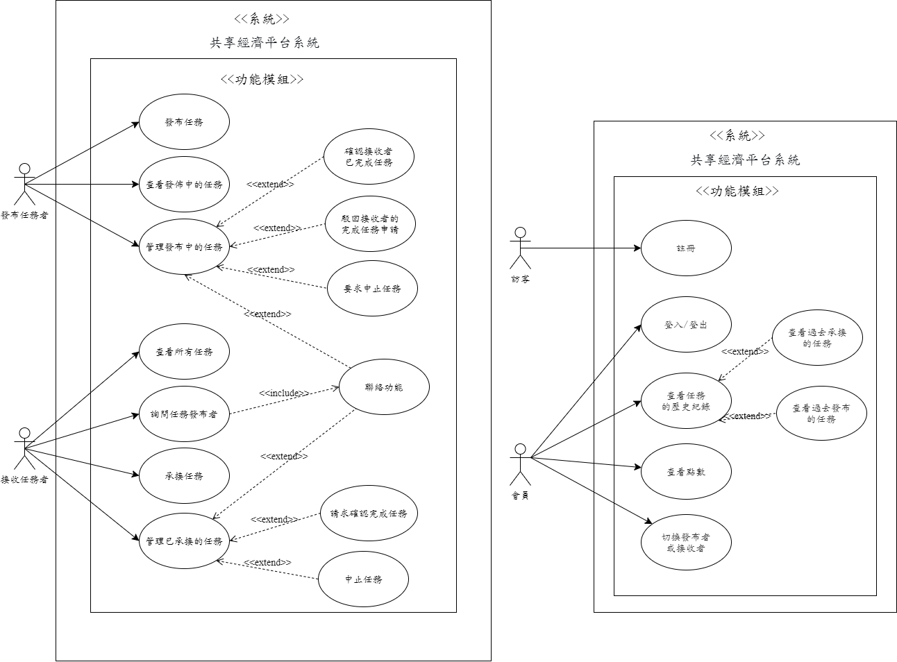
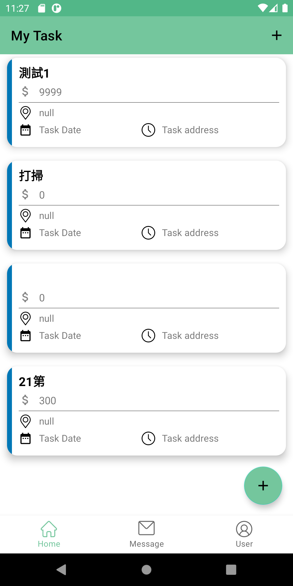
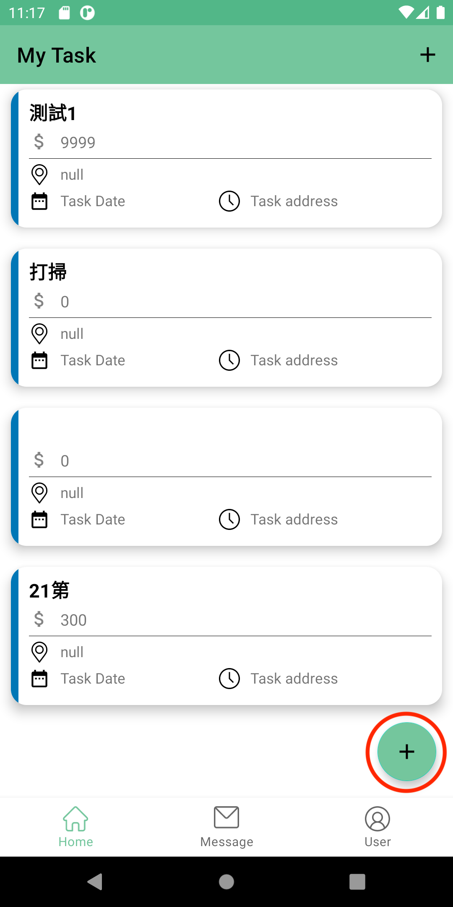
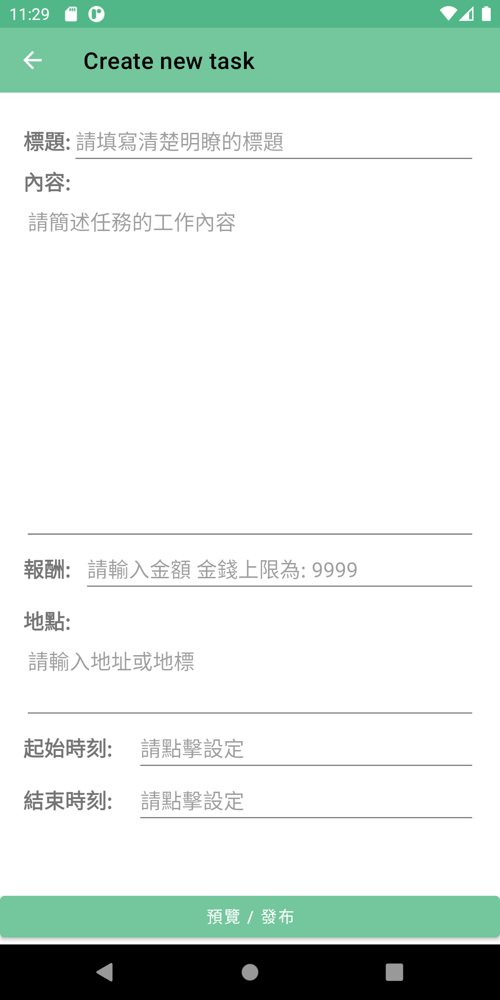
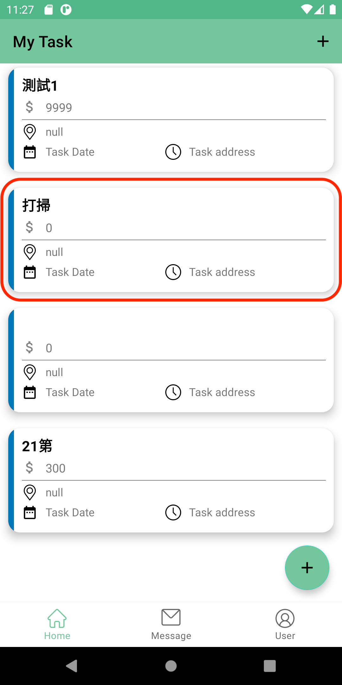
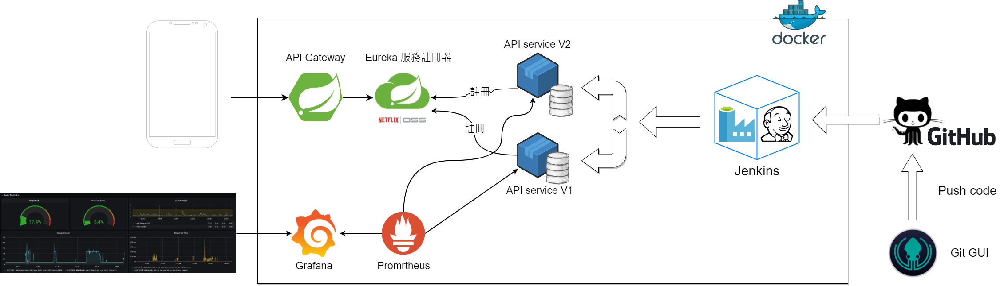
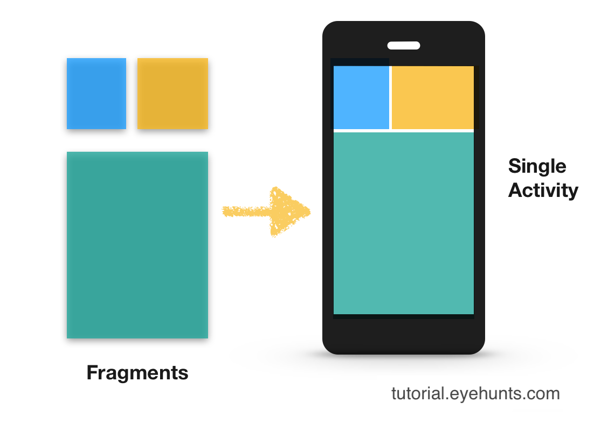
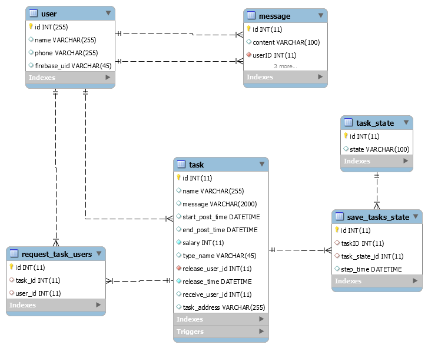
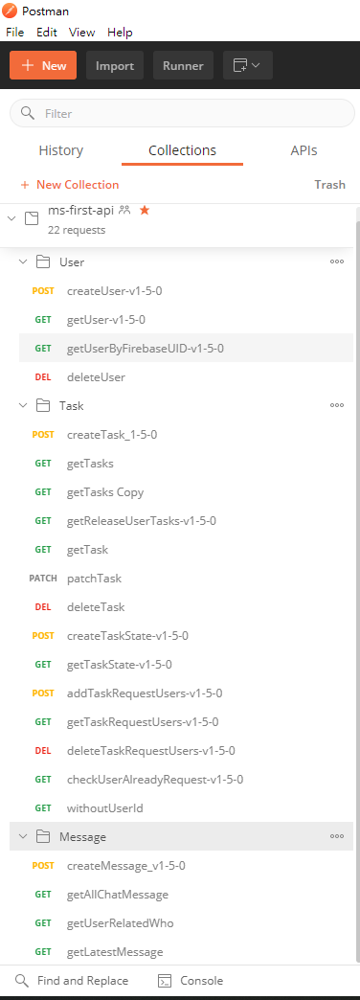
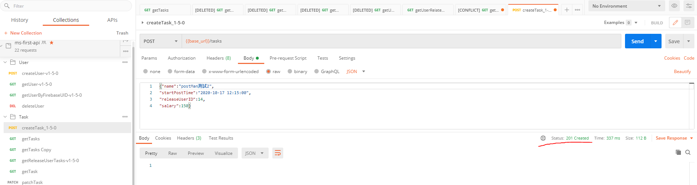

# 基於微服務技術的行動工作共享經濟平台

* 目錄
   * 封面 
   * 誌謝
   * 摘要
   * 緒論
   * 系統功能介紹
   * 系統架構全景圖
   * 前端架構
     * 任務狀態流程 (V)
     * Android Fragment 技術, 元件化頁面(WIP)
     * 與後端API通訊的技術(V)
     * 具備讀取API的單元測試(V)
   * 後端微服務架構
     * 資料庫綱要
     * Spring Boot 實做RESTful API  與微服務容器化
     * 具備微服務功能測試(V)
     * 微服務自動部屬流程
     * 微服務註冊, APIGateway, API微服務版本管理
     * 監控微服務性能
   * 結論
   * 附錄
     * 開發環境
     * 使用到的軟體工具


**系所名稱**：資訊工程學系大學部

**畢專題目**：基於微服務技術的行動工作共享經濟平台 

**指導教授**：陳錫民教授

**學生姓名**：葉育誠，陳怡汶，邱仁煜，彭彥潔

**日期**：

## 誌謝
先省略 之後會補上

## 摘要
此系統為任務交易平台, 可以幫助用戶發佈任務, 而讓其他使用者接收並執行任務, 
例如有位長者想要搬動大量的重物, 但因行動不便, 無法動身, 則可以使用此系統發佈
搬動重物的任務, 並附上地址, 時間跟報酬, 則平台上會匹配適當的用戶去執行此任務,
達成雙方互利, 雙贏的局面。

本文件將會介紹系統前端的設計, 說明介面的規劃與功能, 和使用到的軟體設計模式, 
還會進一步說明後端的架構, 是如何部屬服務?, 如何管理API版本?, 和如何打造自動化的部屬流程?


此App的運行環境為 Android 行動裝置, 系統核心功能包含[發佈任務], [接收任務], [追蹤任務狀態],[管理任務], [用戶溝通介面], 提供使用者能在此平台上交易任務的必要功能。
針對以上複雜的系統功能, 我們後端使用到 Java 的 Spring Boot框架實做RESTful API, 為前端功能提供穩建的服務。

前端的 App, 大量使用到最新的布局技術與現代UI元件 例如:RecycleView, Material Design.
後端則是大量使用到Docker容器化技術部屬API服務, 也使用到 Spring Cloud Netflix 所以提供的 Eureka 服務註冊器, 註冊API服務, 進而管理API版本。

為了方便管理容器, 則是使用 Jenkins工具 搭配 GitHub網站 打造CI/CD的持續整合與持續部屬功能, 當開發者修改好新的API程式碼且 Push 到 GitHub 後, 自動化部屬流程就被觸發, 它將自動打包API服務並裝入Docker容器中運行。

在此報告中還會介紹系統核心的[任務狀態設計], [資料庫設計]。  
總結來說, 此專題打造的系統, 是包含前後端服務 和 容器化技術, 軟體版本控制, 軟體工具使用技術
所建造而成, 而此專題完全開源, 所有的程式碼都在後段章節所提供的GitHub連結中, 有興趣可以幫忙按個星星:)

- 關鍵詞：**任務交易平台**, **Android**, **Spring Boot**, **Docker**, **Jenkins**, **Git**


## 本文
--- 
### 第一章 緒論

#### 開發背景

近年來共享經濟盛行, 冒出了需多共用人力與資源的APP, 
例如Uber, Uber Eat, 小雞上工的找任務, 
而這些都是靠著網路發達與人口密集所造就的新趨勢。 
我們的 任務交易App, 也是屬於上述的類型, 可以由使用者選擇發佈或接收任務, 我們已經實現了一款更加簡單, 通用, 且有效率的任務交易App。

#### 開發動機

因為市面上非常缺少通用的任務交易App, 目前就我所知, 只有[小雞上工App]最近推出的找任務功能, 能夠達成交易任務的模式,所以我們不只想創造更加通用且簡單的任務交易App服務, 
更想在現今的軟體的市場中開創藍海市場。 

#### 開發目的

建構出可正常運行一個任務交易系統所必備的完整功能,
系統還需要有穩固的後端API, 資料庫, 與自動化部屬功能, 
前端的使用者介面, 不只要可以讓使用者選擇發佈與接收任務, 更可以讓使用者之間互相溝通, 追蹤任務狀態, 保存任務資訊, 達成全方位的任務管理與任務交易的系統。


## 第二章 系統功能介紹
### Use Case 

 
 
### 系統介面
##### 發布任務者模式
###### 查看發布中的任務



使用者進入頁面後，便會看到自己發布中的任務，並標注任務名稱、報酬、地點、時間等資訊。

###### 發布任務
 

 
在頁面的左下方，有懸浮的新增任務按鈕

點擊後便會前往創建任務的頁面，輸入完資訊後按下發布即可完成發布。
###### 管理發布的任務

點擊頁面中的任務物件後，即可進入個別任務的詳細資訊頁面，並可在此選擇任務接收者或刪除任務。
// Todo 任務資訊頁面完成後加入圖片


[系統功能介紹](https://hackmd.io/8TEMENorSjSVPnj2WWLLGg?both)

## 第三章 系統架構全景圖
以下為包含後端微服務架構與監控微服務容器


在此簡單介紹一下Docker, 以便說明此架構的設計,
Docker是一個運行容器的軟體, 而容器就是包含著獨立的作業系統與程式的單一顆粒, 也就是只要在容器中裝入Linux作業系統與程式的執行檔, 接著再命令Docker軟體運行此容器, 它即可在一個非常乾淨的環境下運行程式, 而容器也可以儲存成一個壓縮檔, 並提取出來, 放到任何一個有Docker軟體所在的電腦上, 再請Docker運行即可產生一致的結果。

在此後端系統中, 大量使用到Docker的容器化技術, 把可運行的API程式放入一個容器之中, 就能快速的建構容器與監控容器。

以下會介紹自動化部屬容器的技術, 為了方便理解, 會先說明在沒有自動化部屬技術時, 會面臨的情境, 在沒有自動化部屬時, 只能在每次寫完程式碼後, 手動複製程式到電腦機器上, 之後需要經過一連串的, 匯入套件包與複雜的編譯作業, 產生一個執行檔, 接下來還需要設定容器的作業系統, 與網路配置, 再將此執行檔裝入容器之中, 最後命令Docker運行, 有沒有覺得這些步驟非常的繁瑣呢? 如果程式碼有改動則又要再重複一遍上述的流程。

在此畢專中我們使用Jenkins 自動化部屬軟體來解決此問題, 只要在Jenkins 中設定好一次部屬流程, 則可以在每次程式碼更新時, 通知Jenkins 開始工作, 而完成系統部屬的麻煩操作。

所以在此圖的右邊, 可以看到GitHub圖示, 這是表示它將負責儲存程式碼, 與通知Jenkins開始工作, 開發者只需要在本地電腦上推送程式碼到GitHub即可 通知 Jenkinse工作 > 編譯程式 > 打包容器 > 部屬容器, 最後提供給系統前端使用的API服務。 

## 第四章 系統前端架構
### 任務狀態流程
* 以下先以 Boos 稱呼 發布任務的角色, Worker則是執行任務的角色。 
以下是我們程式內部所實做的設計圖。


這是狀態機圖, 在Boos創建任務後, 就會從此圖的START出發, 進入
已發佈狀態, 在此狀態下, 其他使用者可以申請執行此任務, 所以發佈任務不久後, 有可能
已被3位使用者所申請, 那接著發佈任務的Boos角色可以從這三位申請者中挑選執行任務的Worker,
假設Boos 已選擇Worker, 則此任務狀態會轉換到箭頭所指的端點, "Boos已選擇Worker",
在此狀態下Boos需等待Worker按下確認執行, 則任務才會轉換到 "任務執行中",
那如果Worker突然反悔剛才的申請, 不想按下確認執行, 怎麼辦呢?
可以發現在 "Boos已選擇Worker" 狀態有延伸出 Worker取消選擇的箭頭, 這是說明在此狀態下會提供給Worker反悔的選項, 他在按下取消選擇後, 任務的狀態會轉換到 已發佈狀態, 所以同時Boos可以再次重新選擇執行任務的Worker。

任務被執行中狀態, 當Worker執行完任務, 則可以按下請求Boos確認完成的按鈕, 那此任務狀態會轉換成 "等待Boos確認完成此任務",
Boos 可以選擇確認完成, 並給予Worker金錢報酬, 不過如果Worker完成的內容並未達到Boos所規定的, Boos 可以駁回此請求,
則任務狀態會變成 \[任務執行中\]。

而人與人的互動就一定存在者衝突的可能, 或許Worker遇上了非常難纏的Boos, 他確實已經完成任務, 但Boos確不斷駁回,
或是 Boos 遇上非常雷的Worker, 事情都沒確實做完成, 就不斷請求確認完成, 像是上述情境, 該如何解決呢?
其實這就像是現實生活中的合約, Boos 與 Worker都是可以要求毀約的, 以下介紹細節,

當Worker想直接毀約,是被允許的, 可以將任務轉換為 "failure end" 結束的狀態, 因為執行者都沒意願執行了, 總不能逼他做完吧
不過 Boos 角色是不能直接毀約的, Boos只能請求中止任務, 而必須得到Worker的同意才行, 這樣做是要保障Worker的權益, 避免該任務其實已被完成, 但卻被Boos惡意中止。

從此設計中會發現到, 如果Boos 不斷駁回任務, Worker也不中止任務的情況下, 該任務是會永遠停在任務執行中的狀態,
這是為了保留雙方的權益所設計的, 或許之後雙方能交由法律協調。

狀態流程的UI設計:
<圖> 說明各狀態下的功能 


### Android Fragment 技術, 元件化頁面



此系統前端頁面是使用Fragment (片段), 的前端布局方式, 可以單獨製作一個UI顯示元件後就可以重複應用在不同頁面上, Android 上的一個頁面單位成為Activity, 所以可以從上圖得知, 多個frafment元件可以自由組合放進一個Activity之中。
在此系統中應用到的案例為, 顯示任務清單的部分, 因為在顯示清單時有各種不同的需求, 有的需要顯示自己擁有的任務清單, 有的需要顯示已經申請的任務清單, 或是正在進行中的任務清單, 這些都可以用同一個fragment來共用程式碼, 因為有許多地方可以共用程式碼, 讓系統的的核心更簡潔, 也更具有維護性。


### 與後端API通訊的技術
此前端App利用HTTP網路傳輸協定跟後端的API微服務通訊, 然而通訊的API格式為 RESTful API,
這是由 Roy Thomas Fielding 博士於2000年在他的博士論文中提出來的一種API風格,
例如我想知道此系統有哪些任務存在, 可以傳送 http://140.134.26.99/tasks 網址,
則後端系統使用Json格式回傳所有任務的資訊,  假設目前所有任務有兩組,
則它將傳送以下格式的資訊, 會顯示 任務ID:1 的資訊, 與 任務ID:2的資訊。 

```json
{
    "1": {
        "Salary": 500,
        "TypeName": "清潔",
        "ReleaseUserID": 14,
        "ReceiveUserID": 0,
        "Message": "請幫我打掃庭院, 工具會幫您準備好",
        "TaskName": "打掃庭院",
        "ReleaseTime": "2020-11-01T15:40:50",
        "TaskAddress": "台中市文華路100號",
        "StartPostTime": "2020-11-03T12:00:00",
        "EndPostTime": "2020-11-03T15:00:00"
    },
    "2": {
        "Salary": 450,
        "TypeName": "購物",
        "ReleaseUserID": 2,
        "ReceiveUserID": 0,
        "Message": "請幫我買價錢300元內的延長線",
        "TaskName": "購買延長線",
        "ReleaseTime": "2020-11-02T8:40:00",
        "TaskAddress": "台中市文華路800號",
        "StartPostTime": "2020-11-04T18:00:00",
        "EndPostTime": "2020-11-04T17:00:00"
    }
}
```

,  又或者我只想知道 Task ID 1 的資訊就好, 在RESTful API格式中, 
可以傳送 http://140.134.26.99/tasks/1 網址, 則後端將只會回應任務ID為1的資訊, 如下

```json
{
    "1": {
        "Salary": 500,
        "TypeName": "清潔",
        "ReleaseUserID": 14,
        "ReceiveUserID": 0,
        "Message": "請幫我打掃庭院, 工具會幫您準備好",
        "TaskName": "打掃庭院",
        "ReleaseTime": "2020-11-01T15:40:50",
        "TaskAddress": "台中市文華路100號",
        "StartPostTime": "2020-11-03T12:00:00",
        "EndPostTime": "2020-11-03T15:00:00"
    }
}
```
那前端App 是如何傳送此API的網址, 給後端的呢? 
這邊我們使用, OkHttp, 這是由 Square 出產的開源專案, 可以有效率的運行HTTP連線,

如下方法, 為傳送 拿到所有任務的API網址

```java
Request request = new Request.Builder()   // 提供連線資訊
                        .url("http://140.134.26.99/tasks")
                        .method("GET", null)
                        .build(); 


// 利用 OkHttp 建造 OkHttpClient 連線物件
OkHttpClient client = new OkHttpClient().newBuilder().build(); 

// 將連線資訊 傳入 連線物件並執行
Response response= client.newCall(request).execute(); 
```

當然串接API的程式碼不只有這樣簡單的三行, 之後還需要處理JSON格式轉換, 非同步運行等等的細節,
如果我把程式碼全貼上來, 那就太占篇幅了, 
這在專案的 src/main/java/Task/TaskAPIService.java中可以找到。

在這裡稱呼 TaskAPIService , 為一個服務元件, 這物件主要封裝系統在拿取API服務的操作細節,
而系統中所有API服務元件如下:
TaskAPIService.java      // 發佈任務, 拿取任務狀態 ... 
MessageAPIService.java  // 聊天, 傳訊息, 查看誰傳訊息 ...
UserAPIService.java    // 登入 登出 拿取使用者資訊 ...

以上為簡單介紹此系統的API樣貌, 可以初步了解系統的架構 
更多的系統細節會如剝洋蔥般, 一層一層的在往後的章節說明。

### 具備讀取API的單元測試(V)

[參考](https://hackmd.io/@9qakRthtSPSYbGjjVCtE0A/SJw7gJ-FD)

為了能夠提高開發時的穩定度，我們需要確保API能夠正常運行， 所以我們在前端加入API的單元測試， 不只方便測試API是否正確， 而且將來如果後端API被修改時，只要運行此單元測試，就能立刻得知修改過後的API是否能在前端系統中正常運作。

#### 以TaskAPIService為例

##### 新增任務的API測試

以TaskBuilder函數建立任務名稱為打掃庭院的任務， 再將此物件傳入API服務元件 taskApiService, 則可以依據該API的回應訊息確認是否成功發送API。

```java
@Test
public void post() {
        TaskAPIService taskApiService = new TaskAPIService();

        Task task = TaskBuilder.aTask()
                .withTaskName("打掃庭院")
                .build();

        taskApiService.post(task, new Callback() {

            @Override
            public void onResponse(@NotNull Call call, @NotNull Response response) throws IOException {
                assertTrue( response.isSuccessful() )
            }
            // 略
        });
}
```
所以只要此測試通過, 則系統的其他部分只需要知道 TaskApiService 這個API服務元件, 能夠正確的提供給我所有的任務資訊。  


## 第五章 後端微服務架構

### 資料庫綱要



// Todo <說明為何如此設計>

### Spring Boot 實做RESTful API 與 將微服務容器化

Spring Boot 是 Spring 產品中的一個子項目, 目的是要快速搭建基於Spring 的應用程式,
看它名子就知道它想提供開箱即用的特性, 而且它的配置比 Spring 少非常多, 部屬也很方便, 所以被廣泛用來做後端API微服務, 此畢專系統就是為了可以方便部屬微服務, 與用優雅的程式碼達成後端API, 所以使用目前最主流, 資源也最多的Spring Boot做為後端的框架,
而Spring Boot也有一個優點為打包時創建的java 應用為 jar 執行檔, 所以之需要將此jar檔放進容器中並給 JVM (`Java Virtual Machine`) 來執行即可, 以下舉個系統中使用到的API是如何製作, 與最終如何裝入Docker 容器並運行。

這是可以拿取所有任務的API的程式碼

可以關注開頭的 `@` 符號, 這是注釋語法, 可以設定這個API的格式,

像是 `@RequestMapping(value ="/tasks")`

表示當API 格式為 /tasks, 就是進入此類別, 接著在依據API類型來執行不同的方法,
像此例為設定API類型為 Get 且在 `/tasks` 後面沒有其他過濾字串時, 就執行此方法, 且回傳一個回應為, `ResponseEntity<Object>`, 所以當此微服務被運行在 IP:
`140.134.45.210` 時, 則要呼叫此API方法就必須傳送 `140.134.45.210/tasks` 且類型設定為Get, 才能拿到此回應。

```java
@RestController
@RequestMapping(value ="/tasks")
public class TaskController {} {

  @GetMapping("")
      public ResponseEntity<Object> getTasks() {
          HttpHeaders headers = createBaseHttpHeaders();

          List<Task> taskList = taskDB.getTasks();

          Map<String, JSONObject> entities = new HashMap<String, JSONObject>();

          for (Task task : taskList) {
              int taskId = task.getTaskID();
              JSONObject entity = getTaskEntity(task);

              entities.put(String.valueOf(taskId), entity);
          }

          return new ResponseEntity<Object>(entities, headers, HttpStatus.OK);
      }
}
// 略
```

當寫完此API程式碼後, 可以經由Maven 打包java程式, 成app.jar檔, 再利用 Docker 打包此app.jar檔到容器之中, 以下為如何打包的過程。
以下為 指定容器的運行環境為擁有openjdk 的環境之中, 接下來COPY 本地的app.jar 進入容器之中, 第三行為命令java 執行 app.jar 檔

```Dockerfile
FROM openjdk:8-jdk-alpine
COPY app.jar app.jar
ENTRYPOINT ["java","-jar","/app.jar"]
```

從上述可以得知此系統後端的部屬是將程式碼打包, 執行檔, 放入容器中, 並且運行,
整個流程可以說是非常現代化, 且易於管理, 當有新的API程式碼被添加時, 可以再次打包, 再次產生執行檔, 接著再放入另一顆容器之中運行, 這樣舊版的微服務容器不會被受影響,
新版的也能穩定運行。


### 具備微服務功能測試(V)

開發API時，常常需要與資料庫打交道與最終部屬完成後需要得知API有沒有正常運行, 所以在此介紹我們是如何進行後端開發的軟體測試。

#### 以創建任務為例
後端在提供創建任務的服務時, 在最底層的部分, 需要製作與資料庫溝通的函數, 在此我們製作一個TaskDB類別來做為 任務資訊與資料庫的溝通的服務者, 以下例子, 為傳入一個Task物件, 則資料庫應該完成創建任務的工作。
```java
taskDB.createTask(Task task);
```
以下說明利用JUnit, 來自訂任務與測試該函數有沒有被正確運行。
taskDB.createTask(Task task); 會回傳 true 或 false, 表示任務在資料庫中是否有被新增
```java
static final TaskDB taskDB = TaskDB.getInstance();

@Test
public void createTask() {

    Task task = TaskBuilder.aTask()
                .withName("協助搬家")
                .build();
                
    assertTrue( taskDB.createTask(task) );
}
```
因此開發過程中, 就可以很快地得知系統能否跟資料庫做溝通,
再來說明API的程式部分, 在使用者用post請求`/tasks` API時, 第一個進入點就是以下程式, 可以發現它會使用較低層的 `TaskDB` 類別, 來為它提供服務, 最後將會回傳Http的回應。
```java
@RestController
@RequestMapping(value ="/tasks")
public class TaskController {
    TaskDB taskDB = TaskDB.getInstance();
    TasksStateDB tasksStateDB = TasksStateDB.getTasksStateDB();
    RequestTaskUsersDB requestTaskUsersDB = RequestTaskUsersDB.getInstance();

    @PostMapping(value = "")
    public ResponseEntity<String> createTask(@RequestBody Task task) {
        // 使用到 TaskDB 類別
        boolean is_success = taskDB.createTask(task);

        HttpHeaders headers = createBaseHttpHeaders();

        if(is_success) {
            return new ResponseEntity<String>(headers, HttpStatus.CREATED);
        } else {
            return new ResponseEntity<String>("Error to build Task in DB", headers, HttpStatus.BAD_REQUEST);
        }
    }
}
```

那以上API功能如何測試與管理呢? 微服務所提供的API會有好幾個,
也會有版本的更新, 所以我們在此使用Postman 測試與管理API,
Postman 是一個企業級的API測試工具, 可以優美的管理API, 如下圖是我們的所有API管理。



它不只能管理, 也能單獨發送一個API, 如下圖為發送新增任務的API,
可以發現紅線標註的部分顯示created, 代表該API有正確運行。



### 微服務自動部屬流程
在使用微服務架構時, 因為會需要快速部屬微服務與測試,
才能確保此服務是有效的, 所以必定少不了自動化的流程,
目標為在開發者修改好API的程式碼且上傳到GitHub存放後, 就必須要
有能夠運行的API服務被部屬完成, 所以當開發者加一個API的功能後, 
就可以即時用測試API的工具, 來測試API功能。 在此我們使用企業中常見的Jenkins
工具來自動部屬微服務, 可以將 GitHub 專案鏈結到Jenkins中, 當有push 事件時, 會自動打包程式碼與創建Docker 容器並部屬到機器上, 流程圖如下:


### 微服務註冊, APIGateway, API微服務版本管理

因軟體在開發時會生成很多微服務, 例如 第一版本的API的微服務, 第二版本的API的微服務......, 會有需多版本出現, 又或者為了伺服器的負載不要太重, 會把相同的微服務放到多台機器上, 接著前端應用在連線時, 可以依據電腦負載而把請求送到不同機器上的微服務中, 達到負載平衡, 所以需要有方法來管理眾多的微服務, 在此是用目前最主流的服務註冊器, 來將微服務自動註冊到該註冊器中, 服務註冊器是由XX 開發, 它一樣可以放在一個容器中運行, 所以由此圖可以看到它是被放在Docker的範疇之中, 以下為展示註冊器的顯示頁面, 


註冊器所擁有的功能只有收集所有的微服務的資訊, 它可以知道該微服務是在哪一台機器的IP上與port去提供該服務, 但它還需要一個入口功能, 稱之為API GateWay, 此服務為查詢在註冊器中的微服務位置, 並由此窗口提供服務, 因為前端其實只是想得到服務, 他並不需要知道該服務實際上在哪一台機器的哪個port上, 它只需要傳送請求給APIGateway, 則APIGateway 會自動去註冊器中找尋服務的實例, 並轉發請求, 之後從微服務得到回應後, 再轉發給前端的請求者, 所以在此過程中前端只需要知道單一的窗口即可請求任何微服務,
例子:

### 監控微服務性能


## 第六章結論

## 附錄
### 開發環境
前端行動APP使用 Google 所提供的 Android Studio IDEA.
後端微服務使用 Intellij IDEA
